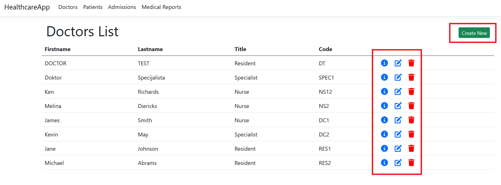
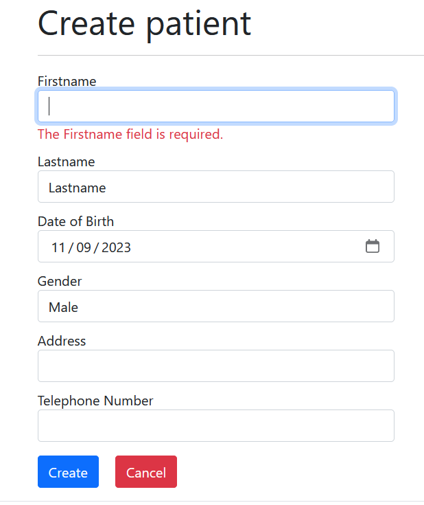
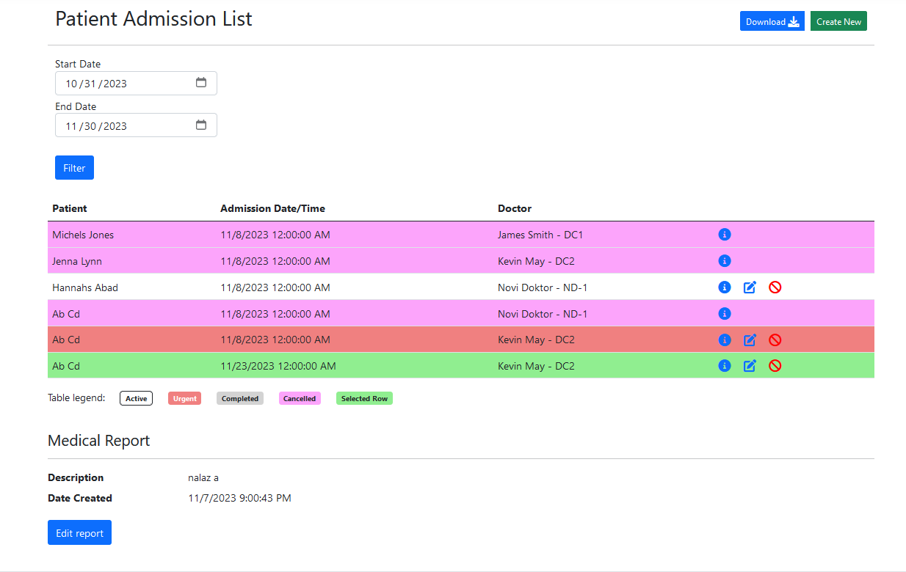

# healthcare-app
ASP.NET MVC core aplikacija za manju kliniku.

## Tehnologije korištene
- [ASP.NET MVC core (.NET 6)](https://dotnet.microsoft.com/en-us/download/dotnet/6.0)
- Entity Framework core (code-first metoda)
- Bootstrap 5

## Instrukcije za postavku projekta lokalno
1. Instalirati [.NET 6 SDK](https://dotnet.microsoft.com/en-us/download/dotnet/6.0)
2. Potreban MS-SQL server, preporučljivo koristiti [Docker MS-SQL image](https://hub.docker.com/_/microsoft-mssql-server). Sačuvajte konekcioni string koji budete koristili za pristup bazi.
3. Klonirati projekt i otvoriti sln u VS Studio
4. U VS Studio developer terminalu se pozicionirati na root projekta. Za postavku konekcionog stringa (iz koraka 2) u projektu za SQL bazu koristiti komande:

        dotnet user-secrets init

        dotnet user-secrets set "ConnectionStrings:HealthcareApp" "Data Source=localhost,1433;Initial Catalog=Healthcare;Password=VasPassword;User Id=SA;Encrypt=false;"
     
5. Pokrenuti komandu: dotnet ef database update

6. Pokrenuti projekt.

## Organizacija koda
Uz standardne direktorije MVC projekta, uvedeni su dodatni za organizaciju.

 - Migrations - auto-generirani Entity Framework kod za generiranje baze i popunjavanje inicijalnih podataka u bazi
 - Repository - klase koje enkapsuliraju database CRUD operacije. Generična implementacija CRUD operacija se nalazi u [CrudRepository klasi](./HealthcareApp/Repository/Implementation/CrudRepository.cs). A operacije koje su specifične za pojedine klase se nalaze u istoimenim \<ImeKlase\>Repository klasama.
 - Utils - različite pomoćne klase, atributi i exception klase
 - Unutar Model direktorija se nalaze *Data* klase u sklopu *DataModels* direktorija, dok se pomoćne view klase nalaze u *ViewModels* direktoriju.
 - wwwroot - su ubačene pomoćne javascript klase i css

Povezivanje repozitorij sloja sa kontrolerima realiziran je putem Dependency Injection sistema.

## O aplikaciji
Za sve navedene entitete u postavci (pacijent, ljekar, prijem i nalaz) su napravljeni zasebne podstranice sa tabelom svih navedenih entiteta u sistemu respektivno:

Na navedenoj slici su označene akcije koje se nad specifičnim stavkama tabele mogu raditi: pregled detalja, uređivanje i brisanje (s lijevo na desno)
U gornjem desnom kutu se nalazi dugme za kreiranje nove stavke. Imati u vidu, da su sve navedene akcije moguće na stranicama pacijenta i doktora.
Dok na stranicama nalaza je moguće samo pregledati detalje o nalazu (stranica nalaza je uvedena isključivo informativno), a na stranici prijema se pored pregleda detalja je moguće urediti i otkazati prijem.

### Operacije uređivanja i kreiranja

 

Princip uređivanja i kreiranja stavki je posve identičan za svaki entitet. Validacija je realizirana sa serverske strane korištenjem validacijskih atributa kao i 'custom' atributa za scenarije koje ugrađeni atributi ne pokrivaju. Primjerice za provjeru da li su datumi prijema uneseni u budućnosti koristi se custom atribut [DateNotInFuture](./HealthcareApp/Utils/DateNotInFutureAttribute.cs).

### Sekcija prijema pacijenta
Stranica prijema pacijenta je realizirana kao *Partial View* koji se koristi na istoimenoj stranici i kao podsekcija na stranici pacijenta. Stranica se sastoji iz filtera za stavke, tabela stavki prijema i za odabranu stavku prijema (dupli klik na red) se otvara podsekcija sa nalazima za dati prijem.
 

Kao što je vidljivo sa slike 3, na tabeli se nalaze filtrirani prijemovi od 30.10.2023 do 18.11.2023. Prijem može biti različitog statusa i u legendi tabele su navedeni redom sljedeći statusi:

 - Aktivan (Active) - prijem je aktivan i treba da se obavi u budućnosti. Za ovakav prijem je moguće sami prijem mijenjati kao i pripadajući nalaz.
 - Hitan (Urgent) - prijem koji je označen kao hitan. Ista pravila vrijede kao i za Aktivan prijem.
 - Završen (Completed) - prijem koji je završen i za koji se može jedino uređivati/dodavati nalaz
 - Otkazan (Cancelled) - prijem koji je otkazan. Ne može se mijenjati niti mu se pridružvati nalaz.

Dvoklikom na jedan od redova se otvara sekcija koja prikazuje nalaz ukoliko postoji, uz mogućnost da se isti izmjeni ili ukoliko nalaz ne postoji moguće ga je kreirati klikom na ponuđeni link.
